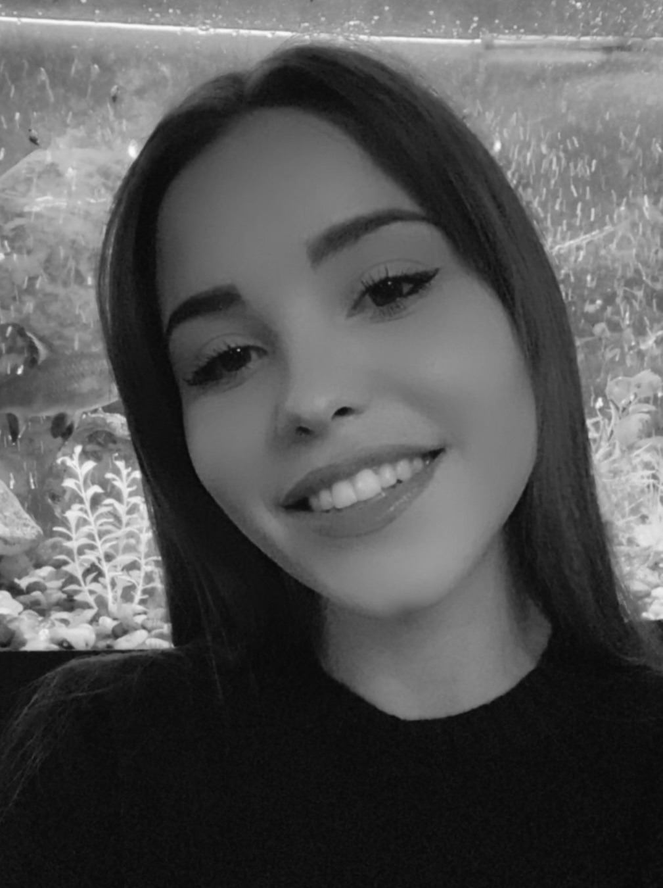

# Немного обо мне.
Меня  зовут Вероника! Мне 28 лет.

## _Образование_
В 2016 году закончила Российский технологический университет по специальности "Производственный менеджмент".

## _Карьера_
Проработав 6 лет бизнес-ассистентом в различных компаниях я решила попробовать для себя что-то новое и получить возможность работать удаленно не только в Москве, но и в любой точке мира

## _Хобби_
В свободное время занимаюсь верховой ездой, катаюсь на вейкборде, но иногда просто смотрю дома сериалы.

## _Нетология_
Сейчас учусь в Нетологии на тестироващика и надеюсь, что в будующим смогу себя реализовать в этой роли.
